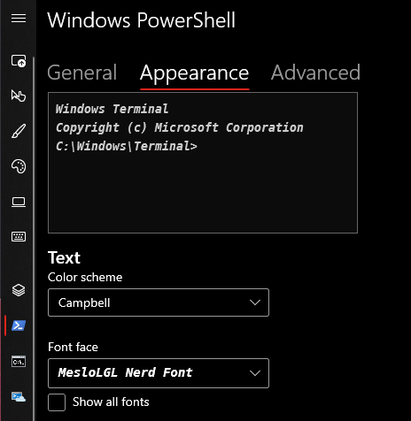

 <h1>How to properly run the game: </h1>
    <ol>
        <li>Download the repository</li>
        <li>Install Windows Terminal from this link: </li>
        
<a href = "https://docs.microsoft.com/en-us/windows/terminal/install"> Download Windows Terminal</a>

        <li>Install Nerd Font (Meslo NerdFont) to properly show symbols</li>
        
<a href  = "https://www.nerdfonts.com/font-downloads">Download font</a>

        <li>Set the Meslo Nerd Font as default Powershell font in the Windows Terminal</li>
        
        <li>Run the file by "./"filename</li>
    </ol>
